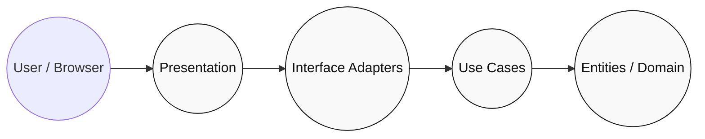
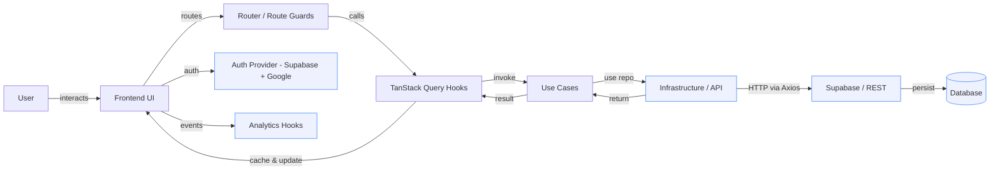

# Task Management System

A Kanban-style task management frontend built with **React 19**, **TypeScript**, and **Vite**, following **Clean Architecture** principles. The app provides drag-and-drop boards, subtasks, comments, attachments, weekly goals, statistics, export functionality, and Google Sign-In authentication via Supabase.

---

## Table of Contents

1. [Overview](#overview)
2. [Architecture](#architecture)
3. [Project Structure](#project-structure)
4. [Data Flow](#data-flow)
5. [Features](#features)
6. [Tech Stack](#tech-stack)
7. [Testing](#testing)
8. [Security](#security)
9. [CI/CD & Deployment](#cicd--deployment)
10. [Getting Started](#getting-started)

---

## Overview

This is a **client-side** Kanban task manager. Responsibilities are split across four Clean Architecture layers:

| Layer | Responsibility |
|-------|---------------|
| **Presentation** | React components, pages, layouts, UI hooks, and CSS/Tailwind styling |
| **Interface Adapters** | Redux store, TanStack Query hooks, route guards, context providers, mappers |
| **Use Cases** | Application business logic — task CRUD, kanban reordering, subtasks, comments, exports, weekly goals, auth |
| **Entities / Domain** | Core domain objects, DTOs, enums, validation schemas, and utility helpers |

---

## Architecture

### Clean Architecture Diagram



- **Presentation** — React components, pages, layouts, and UI hooks (`src/presentation`).
- **Interface Adapters** — Redux slices, TanStack Query hooks, route guards, context providers, mappers (`src/app`, `src/InfraStructure/mappers`).
- **Use Cases** — Application workflows: task CRUD, kanban reordering, subtasks, comments, exports, weekly goals, auth (`src/domain/usecases`).
- **Entities** — Core domain objects, DTOs, enums, sanitization schemas (`src/domain/entities`, `src/domain/enums`, `src/lib/sanitization`).

### Detailed Process Flow



---

## Project Structure

```mermaid
flowchart TD
  Root[Project Root] --> src
  Root --> public["public / PWA manifest"]
  Root --> devDist["dev-dist / SW registration"]
  Root --> github[".github / CI + Dependabot"]

  src --> app["app / Interface Adapters"]
  src --> domain["domain / Use Cases + Entities"]
  src --> infra["InfraStructure / API + Mappers + Storage"]
  src --> pres["presentation / UI Layer"]
  src --> lib["lib / Supabase, Sanitization, Crypto"]
  src --> types["types / Shared TypeScript types"]

  app --> routes["routes / Router + Guards"]
  app --> Queries["Queries / TanStack Query hooks"]
  app --> Providers["Providers / Theme, Modal"]
  app --> contexts["contexts / ModalContext"]
  app --> hooks["hooks / Auth, DnD, Export, Analytics..."]
  app --> redux["redux / Store + Slices"]

  domain --> entities["entities / DTOs + Entities"]
  domain --> enums["enums / TaskPriority"]
  domain --> usecases["usecases / Business Logic"]
  domain --> utils["utils / Date, Export, Task-UI"]

  infra --> api["api / Axios + Supabase clients"]
  infra --> mappers["mappers / Task, Kanban mappers"]
  infra --> storage["storage / Token, Local, Session"]

  pres --> Pages["Pages / 13 page components"]
  pres --> components["components / Kanban, Export, UI..."]
  pres --> hooks["hooks / Auth, Theme, Debounce, Export"]
  pres --> Layout["Layout / MainLayout, AuthLayout"]

  classDef folder fill:transparent,stroke:#666,stroke-width:1px,color:#111;
  class Root,src,app,domain,infra,pres,lib,types folder;
```



### Directory Breakdown

<details>
<summary><strong>src/app/ — Interface Adapters</strong></summary>

| Subdirectory | Key Files | Purpose |
|-------------|-----------|---------|
| `routes/` | `router.tsx`, `mainRouter.tsx`, `authRouter.tsx`, `publicRoute.tsx`, `protectedRoute.tsx` | Route definitions, auth guards, public/protected wrappers |
| `Queries/` | `task.query.ts`, `kanban.query.ts`, `subtask.query.ts`, `comments.query.ts`, `attachment.queries.ts`, `auth.query.ts`, `weeklyGoals.query.ts`, `export.query.ts` | TanStack Query hooks for server-state caching, mutations, and invalidation |
| `Providers/` | `ThemeProvider.tsx`, `ModalProvider.tsx` | Global context providers |
| `contexts/` | `ModalContext.ts` | Modal state context definition |
| `hooks/` | `useAuth.ts`, `useDragAndDrop.ts`, `useExport.ts`, `useGlobalModal.ts`, `useHomeAnalytics.ts`, `useKanbanTasks.ts`, `useModal.ts`, `useRateLimitState.ts`, `useSanitizedForm.ts`, `useWeeklyGoals.ts`, `useDebounce.ts`, `useTaskDetails.tsx` | Application-level hooks bridging UI and use-cases |
| `redux/` | `store.ts`, `slices/theme.slice.ts`, `slices/search.slice.ts` | Redux store with theme and search slices |

</details>

<details>
<summary><strong>src/domain/ — Use Cases + Entities</strong></summary>

| Subdirectory | Key Files | Purpose |
|-------------|-----------|---------|
| `entities/` | `task.entity.ts`, `task.dto.ts`, `task-api.response.ts`, `kanban.entity.ts`, `kanban.dto.ts`, `subTask.dto.ts`, `subTask-api.response.ts`, `comments.dto.ts`, `comments.response.ts`, `attachment.dto.ts`, `WeeklyGoals.ts`, `stats.ts`, `auth.dto.ts`, `export.dto.ts`, `get-tasks-query.dto.ts`, `get-subtasks-query.dto.ts`, `get-comments-query.dto.ts`, `SeoProps.ts`, `Sanitizarion.dto.ts`, `user.ts` | Domain entities, DTOs, API response types, and query DTOs |
| `enums/` | `task-priority.enum.ts` | Domain enums (task priority levels) |
| `usecases/` | `task.usecases.ts`, `kanban.usecases.ts`, `subtask.usecases.ts`, `comments.usecases.ts`, `attachment.usecases.ts`, `auth.usecases.ts`, `weeklyGoals.usecases.ts`, `export/exportToPDF.usecase.ts`, `export/exportToExcel.usecase.ts`, `export/exportToCSV.usecase.ts`, `export/exportTasks.usecase.ts` | Application business logic for each feature |
| `utils/` | `date.ts`, `task-ui.tsx`, `export/` | Domain utility helpers (date formatting, task UI helpers, export utils) |

</details>

<details>
<summary><strong>src/InfraStructure/ — API + Mappers + Storage</strong></summary>

| Subdirectory | Key Files | Purpose |
|-------------|-----------|---------|
| `api/` | `http.ts`, `task.api.ts`, `kanban.api.ts`, `subTask.api.ts`, `comments.api.ts`, `Attachment.api.ts`, `auth.api.ts`, `weeklyGoal.api.ts` | Axios HTTP client and per-feature API adapters |
| `mappers/` | `task.mapper.ts`, `kanban.mapper.ts` | Map raw API responses to domain DTOs |
| `storage/` | `token.storage.ts`, `localStorage.ts`, `sessionStorage.ts` | Browser storage adapters for auth tokens and persisted data |

</details>

<details>
<summary><strong>src/presentation/ — UI Layer</strong></summary>

| Subdirectory | Key Files | Purpose |
|-------------|-----------|---------|
| `Pages/` | `HomePage.tsx`, `Kanban.tsx`, `TaskPage.tsx`, `TaskDetails.tsx`, `CreateTask.tsx`, `LoginPage.tsx`, `RegisterPage.tsx`, `AuthCallback.tsx`, `ProfilePage.tsx`, `EditProfilePage.tsx`, `StatisticsPage.tsx`, `WeeklyGoals.tsx`, `NotFoundPage.tsx` | 13 page-level route components |
| `Pages/WeeklyGoals/` | `GoalList.tsx`, `GoalItem.tsx`, `GoalItemCompact.tsx`, `GoalDetailsModal.tsx`, `EditGoalModal.tsx`, `AddGoalModal.tsx` | Weekly goals sub-components |
| `components/` | `TaskCard.tsx`, `SearchInput.tsx`, `SanitizedSearchInput.tsx`, `Navbar.tsx`, `Footer.tsx`, `ThemeToggle.tsx`, `ScrollToTop.tsx`, `MetaData.tsx`, `TaskHistory.tsx`, `TaskUpdateForm.tsx`, `TaskChart.tsx`, `StatsBarChart.tsx`, `SubTaskList.tsx`, `commentsList.tsx`, `streak.tsx`, `pagination.tsx`, `Button.tsx` | Feature components |
| `components/Kanban/` | `CardDetailDialog.tsx`, `AddCardDialog.tsx`, `AddColumnDialog.tsx`, `AddBoardDialog.tsx`, `EditBoardDialog.tsx`, `EditColumnDialog.tsx` | Kanban-specific dialogs |
| `components/DragAndDrop/` | `SortableItem.tsx`, `DraggableContainer.tsx` | Drag-and-drop wrappers (@dnd-kit) |
| `components/export/` | `ExportModal.tsx`, `ExportOptions.tsx`, `ExportButton.tsx` | Export UI components |
| `components/attachments/` | `Attachments.tsx` | Attachment upload and display |
| `components/ui/` | 20 shadcn/ui components (button, card, dialog, form, input, select, tabs, tooltip, etc.) | Radix UI + Tailwind-based reusable UI primitives |
| `hooks/` | `useAuth.ts`, `useTheme.ts`, `useDebounce.ts`, `useExportHandlers.ts` | Presentation-level hooks |
| `Layout/` | `MainLayout.tsx`, `AuthLayout.tsx` | Page layout wrappers |

</details>

<details>
<summary><strong>src/lib/ — Shared Utilities</strong></summary>

| File | Purpose |
|------|---------|
| `supabase.ts` | Supabase client initialization |
| `constants.ts` | App-wide constants |
| `crypto.ts` | Cryptographic utilities |
| `utils.ts` | General utility functions |
| `authRateLimiter.ts` | Auth request rate limiting |
| `sanitization/html.ts`, `sanitization/text.ts`, `sanitization/types.ts`, `sanitization/index.ts` | HTML/text sanitization (DOMPurify + xss integration) |

</details>

<details>
<summary><strong>src/types/ — Shared TypeScript Types</strong></summary>

| File | Purpose |
|------|---------|
| `Button.types.ts` | Button component type definitions |
| `Modal.types.ts` | Modal component type definitions |
| `task.ts` | Shared task-related types |
| `TimeRange.ts` | Time range filter types |
| `js-cookie.d.ts` | Type declarations for js-cookie |

</details>

---

## Data Flow

### Step-by-step interaction flow

1. **User event** — click, form submit, drag-and-drop, or keyboard shortcut (`Ctrl+K`).
2. **Router / Route Guard** — `src/app/routes/` normalizes the request; `protectedRoute.tsx` enforces auth; `publicRoute.tsx` allows unauthenticated access.
3. **TanStack Query hook** — `src/app/Queries/` manages caching, optimistic updates, and background refetches. Mutations invalidate relevant query keys.
4. **Use Case** — `src/domain/usecases/` applies business rules, validates via DTOs/schemas, and calls infrastructure adapters.
5. **API Adapter** — `src/InfraStructure/api/` performs HTTP requests via Axios to Supabase REST endpoints. Responses are raw JSON.
6. **Mapper** — `src/InfraStructure/mappers/` transforms raw API responses into domain DTOs.
7. **Storage Adapter** — `src/InfraStructure/storage/` persists auth tokens and preferences in browser storage.
8. **Return** — DTOs flow back through use-case → query hook → UI state update → React re-render.

### Authentication flow

1. User clicks **Google Sign-In** on `LoginPage.tsx` or `RegisterPage.tsx`.
2. `auth.usecases.ts` initiates Supabase OAuth redirect.
3. `AuthCallback.tsx` handles the OAuth callback.
4. `token.storage.ts` persists the session token.
5. `protectedRoute.tsx` checks auth state and redirects unauthenticated users.

### Kanban drag-and-drop flow

1. User drags a card via `@dnd-kit` (`DraggableContainer.tsx` + `SortableItem.tsx`).
2. `useDragAndDrop.ts` captures the new position/column.
3. `kanban.usecases.ts` validates and updates priority/status.
4. `kanban.query.ts` sends an optimistic mutation; TanStack Query updates the cache immediately.
5. API adapter persists the change; on failure, the mutation is rolled back.

---

## Features

| Feature | Use Case | Query Hook | UI Components | Notes |
|---------|----------|------------|---------------|-------|
| **Task CRUD** | `task.usecases.ts` | `task.query.ts` | `TaskCard.tsx`, `TaskPage.tsx`, `CreateTask.tsx`, `TaskDetails.tsx`, `TaskUpdateForm.tsx`, `TaskHistory.tsx` | Create, read, update, delete tasks with optimistic updates |
| **Kanban Boards** | `kanban.usecases.ts` | `kanban.query.ts` | `Kanban.tsx`, `CardDetailDialog.tsx`, `AddCardDialog.tsx`, `AddColumnDialog.tsx`, `AddBoardDialog.tsx`, `EditBoardDialog.tsx`, `EditColumnDialog.tsx` | Multi-board support, drag-and-drop columns/cards |
| **Subtasks** | `subtask.usecases.ts` | `subtask.query.ts` | `SubTaskList.tsx` | Nested subtask management per task |
| **Comments** | `comments.usecases.ts` | `comments.query.ts` | `commentsList.tsx` | Threaded comments on tasks |
| **Attachments** | `attachment.usecases.ts` | `attachment.queries.ts` | `attachments/Attachments.tsx` | File upload and download per task |
| **Weekly Goals** | `weeklyGoals.usecases.ts` | `weeklyGoals.query.ts` | `WeeklyGoals.tsx`, `GoalList.tsx`, `GoalItem.tsx`, `GoalDetailsModal.tsx`, `EditGoalModal.tsx`, `AddGoalModal.tsx` | Track weekly objectives and completion rates |
| **Statistics** | `useHomeAnalytics.ts` | — | `StatisticsPage.tsx`, `StatsBarChart.tsx`, `TaskChart.tsx` | Usage analytics, task completion metrics, charts (Recharts + Chart.js) |
| **Export** | `exportTasks.usecase.ts`, `exportToPDF.usecase.ts`, `exportToExcel.usecase.ts`, `exportToCSV.usecase.ts` | `export.query.ts` | `ExportModal.tsx`, `ExportOptions.tsx`, `ExportButton.tsx` | PDF (jsPDF), Excel (ExcelJS), CSV (export-to-csv) export |
| **Auth / Google Sign-In** | `auth.usecases.ts` | `auth.query.ts` | `LoginPage.tsx`, `RegisterPage.tsx`, `AuthCallback.tsx` | Supabase OAuth with Google provider |
| **Profile** | — | — | `ProfilePage.tsx`, `EditProfilePage.tsx` | View/edit profile, upload avatar (uses attachment adapter) |
| **Search (Ctrl+K)** | — | — | `SearchInput.tsx`, `SanitizedSearchInput.tsx` | Global search with sanitization, `Ctrl+K` / `Cmd+K` shortcut |
| **Dark / Light Mode** | — | — | `ThemeToggle.tsx` | Theme provider + Redux slice, CSS variables + Tailwind dark mode |
| **PWA** | — | — | `serviceWorker.ts`, `dev-dist/registerSW.js`, `public/manifest.json` | Installable as PWA via vite-plugin-pwa |
| **Streak Visualization** | — | — | `streak.tsx` | GitHub-style contribution streak for task completion |

---

## Tech Stack

### Runtime & Build

| Tool | Version | Purpose |
|------|---------|---------|
| **React** | 19.x | UI framework |
| **TypeScript** | 6.x | Type safety |
| **Vite** | 8.x | Build tool and dev server |
| **Tailwind CSS** | 4.x | Utility-first styling |

### UI Components & Interaction

| Library | Purpose |
|---------|---------|
| **Radix UI** | Accessible primitives (dialog, dropdown, tabs, popover, checkbox, etc.) |
| **shadcn/ui** | Pre-built Radix + Tailwind UI components (`src/presentation/components/ui/`) |
| **@dnd-kit** | Drag-and-drop for Kanban boards |
| **framer-motion** | Animations and transitions |
| **lucide-react** | Icon library |
| **react-hot-toast** | Toast notifications |
| **cmdk** | Command palette / search component |
| **react-day-picker** | Date picker/calendar |
| **class-variance-authority** + **tailwind-merge** | Variant-based component styling |

### State & Data

| Library | Purpose |
|---------|---------|
| **Redux Toolkit** + **react-redux** | Global state (theme, search slices) |
| **TanStack Query** | Server-state caching, optimistic updates, background refetch |
| **react-hook-form** + **@hookform/resolvers** | Form handling and validation |
| **Zod** | Schema validation (form + DTO validation) |
| **Supabase Client** | Auth + database API |

### Data Processing & Export

| Library | Purpose |
|---------|---------|
| **Axios** | HTTP client for API requests |
| **jsPDF** + **jspdf-autotable** | PDF generation |
| **ExcelJS** + **xlsx** | Excel export |
| **export-to-csv** | CSV export |
| **Recharts** + **Chart.js** | Data visualization and charts |
| **date-fns** | Date formatting and manipulation |

### Security & Sanitization

| Library | Purpose |
|---------|---------|
| **DOMPurify** | HTML sanitization |
| **xss** | XSS filter |
| **js-cookie** | Cookie management (auth tokens) |
| **Crypto utilities** | `src/lib/crypto.ts` |

### PWA

| Library | Purpose |
|---------|---------|
| **vite-plugin-pwa** + **Workbox** | Service worker generation, precaching, routing strategies |

### SEO & Meta

| Library | Purpose |
|---------|---------|
| **react-helmet-async** | Dynamic meta tags and SEO (`MetaData.tsx`, `SeoProps.ts`) |

### Virtualization

| Library | Purpose |
|---------|---------|
| **@tanstack/react-virtual** | Large list virtualization |
| **@tanstack/react-pacer** | Rate-limited/paced async operations |

---

## Testing

- **Framework:** Vitest 4.x with jsdom environment
- **Libraries:** @testing-library/react, @testing-library/jest-dom, @testing-library/dom
- **Test locations:** `__tests__/` folders within each layer

| Layer | Test Files |
|-------|-----------|
| Use Cases | `src/domain/usecases/__tests__/` (createTask, updateTask, createSubTask, updateSubTask, getSubTask, deleteSubTask, attachment) |
| Queries | `src/app/Queries/__tests__/` (attachment.queries) |
| API | `src/InfraStructure/api/__tests__/` (task, kanban, subTask, comment, auth, weeklyGoal, attachment) |
| Mappers | `src/InfraStructure/mappers/__tests__/` (task.mapper) |
| Routes | `src/app/routes/__tests__/` (router) |

```bash
npm ci           # install dependencies
npm test         # run all tests (vitest run)
npm run test:ui  # vitest interactive UI
```

---

## Security

- **Never commit secrets.** Use environment variables (`VITE_*` prefix for Vite) and hosting-provider secret stores.
- **Auth tokens** stored in browser storage via `src/InfraStructure/storage/token.storage.ts`. Prefer HTTP-only cookies server-side when possible.
- **Input sanitization** — DOMPurify and xss filter all user-supplied HTML/text (`src/lib/sanitization/`, `useSanitizedForm.ts`, `SanitizedSearchInput.tsx`).
- **Rate limiting** — `src/lib/authRateLimiter.ts` and `useRateLimitState.ts` throttle auth requests.
- **Security headers** — `netlify.toml` enforces `X-Frame-Options: DENY`, `X-XSS-Protection`, `X-Content-Type-Options: nosniff`, `Referrer-Policy: strict-origin-when-cross-origin`.
- **OAuth** — Google Sign-In via Supabase; client secrets must stay server-side.

---

## CI/CD & Deployment

- **GitHub Actions** — `.github/workflows/ci.yml` (continuous integration), `.github/workflows/deploy.yml` (deployment).
- **Dependabot** — `.github/dependabot.yml` for automated dependency updates.
- **Hosting** — Netlify (`netlify.toml`); SPA redirect rule (`/* → index.html`), security headers configured.
- **Build command:** `npm run build` (TypeScript check + Vite production build).

---

*This documentation reflects the actual codebase structure and is updated to match the current implementation. No sensitive data is included.*