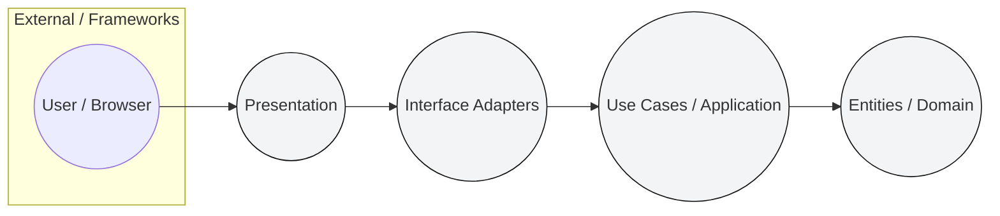
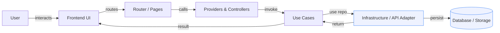
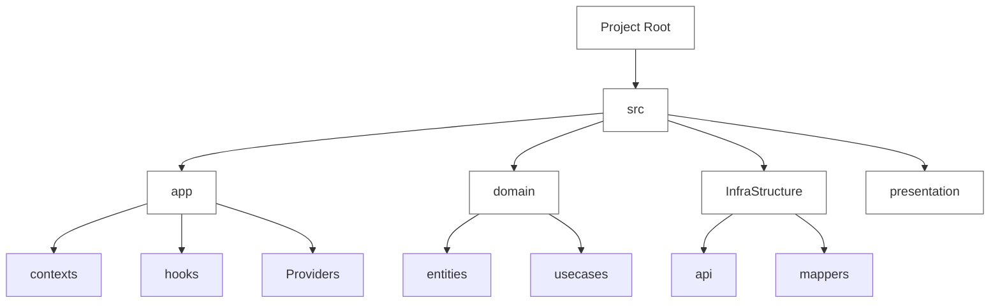
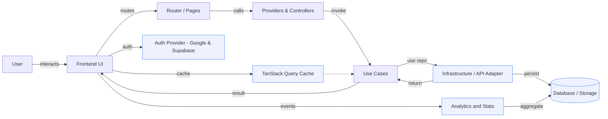
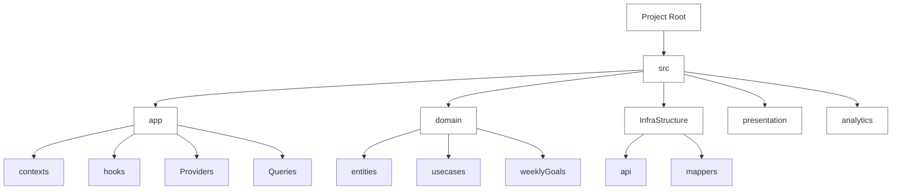

# Task Management System — Overview

This repository is a React + TypeScript application scaffolded with Vite. It implements a task/kanban management frontend following Clean Architecture principles (layers separated by responsibility). The README below documents the system, the flow of data, the major processes, the tech stack, and an architecture visualization (Mermaid diagrams). No sensitive data is included.

**Contents**
- **Overview:** high-level description of the system and responsibilities.
- **How it works:** step-by-step process flows for common interactions.
- **Architecture diagrams:** Clean Architecture circles and project tree (Mermaid).
- **Tech stack:** libraries and services used.
- **Security & environment:** safe handling of secrets and recommended practices.

## Overview

This is a client-side application that provides a Kanban-style task manager. Key responsibilities:
- Presentation: React components, pages, and UI state.
- Routing & Providers: authentication, theme, modal providers, and global state (Redux).
- Use-cases: application business logic (task usecases, kanban handling, subtasks, comments, export).
- Infrastructure: API clients, storage adapters (e.g., Supabase), attachment handling, mappers.
- Domain: entities and DTOs representing tasks, users, subtasks, comments, etc.

## How it works — high level process flow

- User opens the app in the browser and authenticates (UI -> auth router).
- The frontend fetches user-specific data via queries (e.g., tasks, kanban columns) from the API layer.
- UI interactions (create/update task, reorder kanban, add comment) trigger use-case functions.
- Use-cases validate and map data, then call infrastructure adapters to persist changes.
- Infrastructure adapts network/storage responses into domain DTOs and returns results to the UI.

### Process sequence (short)
1. UI event (click/create/update).
2. Router/Controller normalizes request and calls a use-case.
3. Use-case applies business rules and calls repository/adapter.
4. Adapter performs API/storage IO and returns results.
5. Use-case returns DTOs; UI updates state and re-renders.

## Mermaid: Clean Architecture (circles)

Explanation:
- `Presentation` holds React components, pages, UI state and routing.
- `Interface Adapters` include controllers, mappers, DTO transformations, and hooks bridging UI and use-cases.
- `Use Cases` implement application workflows (task CRUD, kanban reordering, comments, exports).
- `Entities` are the core domain objects (Task, Subtask, User) and their invariants.

## Mermaid: Process flow (detailed)

Each node above corresponds to code areas in the repo (examples):
- `Frontend UI`: [src/presentation](src/presentation) components and pages.
- `Providers & Controllers`: [src/app/Providers](src/app/Providers) and hooks in [src/app/hooks](src/app/hooks).
- `Use Cases`: [src/domain/usecases](src/domain/usecases) (task.usecases.ts, kanban.usecases.ts).
- `Infrastructure / API Adapter`: [src/InfraStructure/api](src/InfraStructure/api) and [src/lib/supabase.ts].

## Mermaid: Project tree (simplified)

## Tech stack

- Runtime & build: `Vite`, `React 18+`, `TypeScript`.
- UI & state: `React`, `Redux` (store at `src/app/redux`), CSS modules / plain CSS.
- Data & services: `Supabase` client (see `src/lib/supabase.ts`), REST or GraphQL adapters under `src/InfraStructure/api`.
- Tooling: `ESLint`, `Prettier` (if configured), `Vitest` / `Jest` for unit tests (see `__tests__` folders).
- Deployment: `Netlify` config present (`netlify.toml`) but any static hosting can be used.

## Security & environment

- Never store secrets or API keys in the repository. Use your hosting provider's secret store and server-side configuration for sensitive secrets.
- Use HTTP-only, secure cookies or provider-managed tokens for sensitive auth flows when possible.
- Validate and sanitize user input on both client and server. This project includes basic DTOs and sanitization helpers in `src/domain` and `src/lib/sanitization`.

## Files and structure pointers

- UI pages: [src/presentation/Pages](src/presentation/Pages)
- Use-cases: [src/domain/usecases](src/domain/usecases)
- API adapters: [src/InfraStructure/api](src/InfraStructure/api)
- Store: [src/app/redux/store.ts](src/app/redux/store.ts)

## Features: Statistics & Productivity

- **Statistics & Analytics:** The repo contains analytics hooks (e.g., `useHomeAnalytics.ts`) to capture usage events, page views, and performance metrics. Metrics are designed to be privacy-respecting and avoid storing personal/sensitive data client-side. Aggregate events can be sent to an external analytics service or self-hosted endpoint.
- **Weekly Goals:** Implemented via `useWeeklyGoals.ts` and `weeklyGoals.usecases.ts`. This feature tracks weekly objectives, completion rates, and progress trends.
- **GitHub Green Streak:** Optional productivity integration concept — this can visualize a developer's daily task-completion streak (inspired by GitHub contribution streak visuals). If enabled, integration should use the GitHub API via a server-side adapter to avoid leaking personal tokens; only public activity or an anonymized summary should be stored in the app.

## Auth: Google Sign-In

- Authentication can be provided by Supabase or a custom OAuth2 flow. Google Sign-In is supported via OAuth client IDs configured in your hosting provider.
- Do not commit OAuth client secrets. Store client secrets in the hosting-provider secret store and perform sensitive exchanges server-side when applicable.

## Caching & Performance: TanStack Query

- This project uses TanStack Query (React Query) patterns for server-state caching and background updates to provide fast, optimistic UIs and reduced network load.
- Place query hooks under `src/app/Queries` (e.g., `task.query.ts`, `kanban.query.ts`). Use query keys, mutation functions, and invalidation patterns to keep the UI in sync.

## Mermaid: Updated Process flow (with Auth, Cache, Analytics)

## Mermaid: Updated Project tree (features)

## Notes

- The diagrams above are illustrative and map to code by folder. They intentionally avoid exposing any sensitive tokens or private endpoints.
- If you want, I can also generate a larger PDF/PNG of these Mermaid diagrams or add per-file links to the architecture nodes.

---

_Updated to include architecture visuals, process flows, and tech-stack summary. No sensitive data included._
